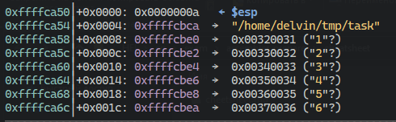

# ЦШпаргалка по работе на ассемблере

## Часто используемые системные вызовы

| Имя   | Номер |         ebx         |         ecx          |       edx       |
| ----- | :---: | :-----------------: | :------------------: | :-------------: |
| exit  | 0x01  |     код ошибки      |          -           |        -        |
| read  | 0x03  | файловый дескриптор |        буфер         | количество байт |
| write | 0x04  | файловый дескриптор |        буфер         | количество байт |
| open  | 0x05  |      имя файла      |        r/w/a         |        0        |
| close | 0x05  | файловый дескриптор |          -           |        -        |
| creat | 0x08  |      имя файла      | разрешения для файла |        -        |

## Как создавать файлы

Для того, чтобы создать файл на ассемблере, необходимо написать такую конструкцию.

```nasm
;int creat(const char *pathname, mode_t mode) - функция в С
mov eax, 0x8		;sys_create - Системный вызов для создания файла
mov ebx, filename	;адрес на строку, содержащую имя файла
mov ecx, 777q		;принимает разрешения, которые необходимо выставить файлу
int 0x80			;системный вызов
mov [fd], eax		;системный вызов вовзращает файловый дескриптор
```

В данном случае для прав выставлено значение `777q`. Буква `q` означает, что `nasm` должен интерпретировать это число в восьмиричной системе счисления. Выставления прав `777q` означает `read, write, execute`, что не очень для файла, т.к. его не нужно исполнять, поэтому можно использовать права `644q`, что означает `read, write` для владельца файла, и `read` для группы и других пользователей.

## Как открывать файлы

Для чтения файлов, используется такая конструкция.  Используется системный вызов `open`.

```nasm
;int open(const char *pathname, int flags);
mov eax, 5			;sys_open - Системный вызов для открытия файла
mov ebx, filename	;адрес на строку, содержащую имя файла
mov ecx, 0			;разрешения для файла
mov edx, 0			;права доступа к файлу
int 0x80
mov [fd], eax		;системный вызов возвращает файловый дескриптор
```

## Как читать файлы

Для чтения из файлов используется системный вызов `read`.

```nasm
mov eax, 3			;sys_read
mov ebx, [fd]		;указываем файловый дескриптор
mov ecx, buf		;буфер, куда будут читаться данные
mov edx, 0x1000		;количество байт для чтения
int 0x80			;системный вызов
;В данном случае в регистре eax возвращается количество успешно прочитанных байт
```

## Как писать в файлы

Для записи в файл используется системный вызов `write`.

```nasm
mov eax, 4			;sys_write
mov ebx, [fd]		;файловый дескриптор
mov ecx, buf		;что записывать в файл
mov edx, 0x1000		;сколько байт записать в файл
int 0x80			;системный вызов
;В данном случае в регистре eax возвращется количество успешно записанных байт
```

## Как закрывать файлы

```nasm
mov eax, 0x06		;sys_close
mov ebx, [fd]		;файловый дескриптор открытого файла
int 0x80			;системный вызов
```

## Как узнать информацию о файле

Для получения информации о файле используется системный вызов `stat64`. Использование этого системного вызова чуть сложнее, т.к. для него нужно создать определенную структуру. Но я покажу как это можно сделать.

```nasm
;int stat(const char *pathname, struct stat *statbuf);
struct stat {
               dev_t     st_dev;         /* ID of device containing file */
               ino_t     st_ino;         /* Inode number */
               mode_t    st_mode;        /* File type and mode */
               nlink_t   st_nlink;       /* Number of hard links */
               uid_t     st_uid;         /* User ID of owner */
               gid_t     st_gid;         /* Group ID of owner */
               dev_t     st_rdev;        /* Device ID (if special file) */
               off_t     st_size;        /* Total size, in bytes */
               blksize_t st_blksize;     /* Block size for filesystem I/O */
               blkcnt_t  st_blocks;      /* Number of 512B blocks allocated */
               struct timespec st_atim;  /* Time of last access */
               struct timespec st_mtim;  /* Time of last modification */
               struct timespec st_ctim;  /* Time of last status change */
}
; Поскольку из определения структуры мы знаем, что это просто область памяти разных типов данных, то можно просто выделить определенный размер под структуру и просто читать туда.

;Выделяем память под структуру
section .bss
	statbuf reb 144

mov eax, 0xc3		;sys_stat64
mov ebx, filename	;адрес на строку с именем файла
mov ecx, statbuf	;указатель на нашу структуру
int 0x80			;системный вызов

;Опытным путем было установлено, что размер файла находится по смещению 44
mov eax, [statbuf + 44]	;теперь в регистре eax лежит размер файла
```

## Как работать с аргументами командной строки

Аргументы командной строки падают на стэк, поэтому чтобы их достать нужно "попать" со стэка.



На фотографии выше показан стэк программы. На вершине стэка лежит количество аргументов, далее имя программы и сами аргументы.  А ниже показано представление стэка, с помощью известных конструкций языка си

```bash
|	  argc		|
|	prog_name	|
|	 argv[1]	|
|	 argv[2]	|
|	 argv[3]	|
|	.........	|
```

Теперь покажем, как доставать эти значения на асме.

```nasm
pop ebx			;достаем количество аргументов
pop ebx			;достаем имя программы
pop ebx			;достаем аргумент 1
pop ebx			;достаем аргумент 2
...
```

Т.е. мы последовательно `попаем` со стэка, чтобы получить необходимые аргументы,  которые затем можно сохранить в другие регистры/память.

## Команды, которые могут быть, но часто не используются

```nasm
xchg eax, ebx  - смена значений двух операндов

xchg регистр, регистр
xchg память, регистр
xchg регистр, память
```

```nasm
xlatb - выполнить преобразование байта

Используется для замены байта в регистре AL байтом из последовательности (таблицы) байтов в памяти.
mov ebx, substitution	;адрес подстановки
mov al, [x]				;получение значения в регистр al
sub al, 0x30			;преобразование из ascii цифры в цифру
xlatb					;выполнить подстновку
```

```nasm
cmovc - переместить значение если был установлен CF(carry flag)

cmp ax, bx		;если ax < bx, то будет установлен CF
cmovc ax, 10	;допустим, если ax оказался меньше bx, то ax должен равняться 10.
```

```nasm
cld - очистить DF(direction flag) 
std - поставить DF
Команды не имеют операндов.
```

```nasm
lodsb - загрузить байт из esi в al и увеличить esi на единицу
Очень полезная команда, которая частенько используется. Эквивалентна таким инструкциям.
mov al, [esi]
inc esi
```

## Полезные источники

**Таблица системных вызовов:** https://chromium.googlesource.com/chromiumos/docs/+/master/constants/syscalls.md#x86-32_bit

**Все что может попасться:** https://google.com :)

## Автор

Подготовлено [студентом](https://vk.com/delvinru) БК252 для подготовки к экзамену по Языкам Программирования.

